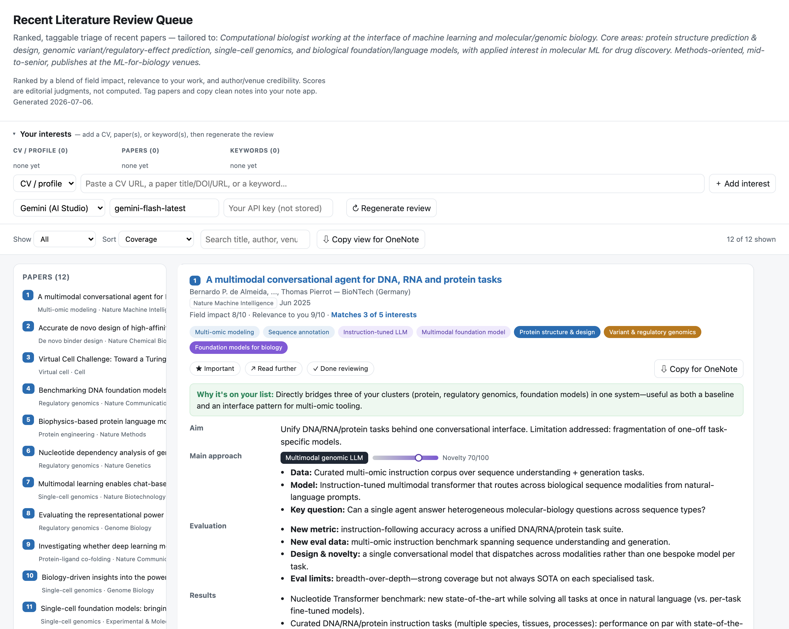
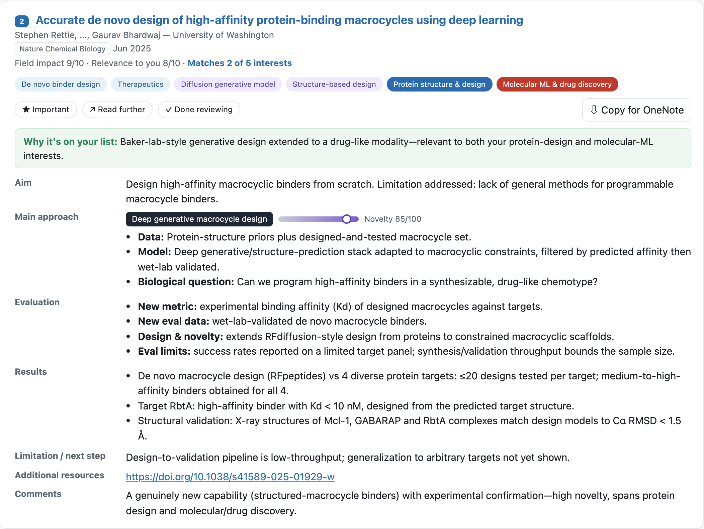
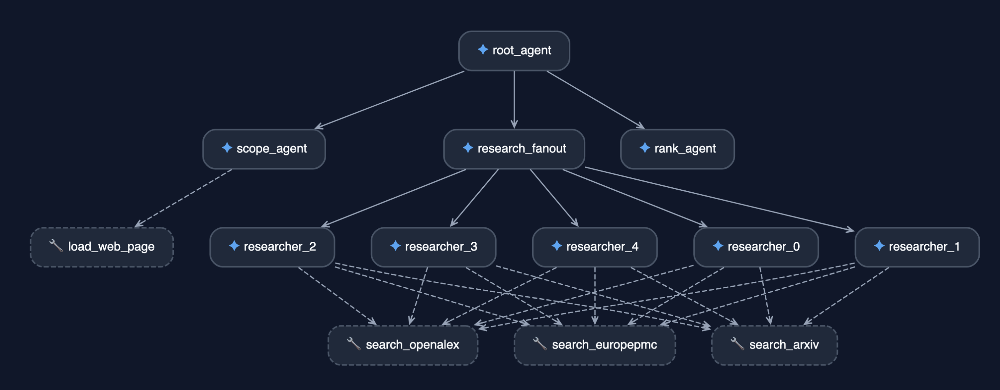

# Literature Reviewer Agent

Lieterature review is often a daunting task. This concierge agent is designed to help you review literature of your field and/or your field of interest in a single view. Use your own API key to regenerate for their field of interest below.

**Live server:** https://literature-reviewer-4055136070.us-central1.run.app/reviewer

## Example output

The agent produces a single self-contained [`literature-reviewer.html`](literature-reviewer.html) file — a static, offline capture of your ranked review queue. Open it directly in a browser (`file://`, no server needed).

**Overall layout** — ranked queue, sidebar, interests panel, and per-paper cards:

**Paper card (detail)** — Aim → Main approach → Evaluation → Results (with quantitative task/data/metric/result bullets) → Limitation:

See [`compbio-paper-review-SPEC.md`](compbio-paper-review-SPEC.md) for the complete specification of this output.

## Building your own server

See [`compbio-paper-review-SPEC.md`](compbio-paper-review-SPEC.md) for the full specification of the generated review app.

1. Have your API keys ready in the `.env` file. See `.env.example` for usage.
2. Build by installing [`agents-cli`]([github.com/google/agents-cli](https://github.com/google/agents-cli)) and running:`agents-cli run "Build my review. Topics: your_topic_of_interest, link to my CV: https://your-url.com"`

## Agent workflow

Generated with `agents-cli playground`. `root-agent` sequentially runs `scope_agent`, `research_fanout`, and `rank_agent`.
